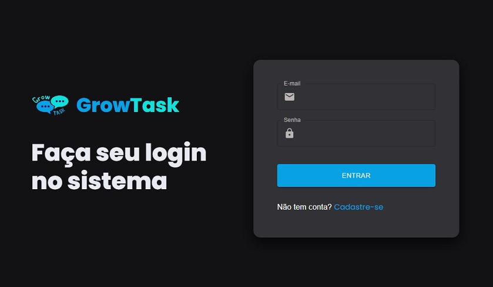
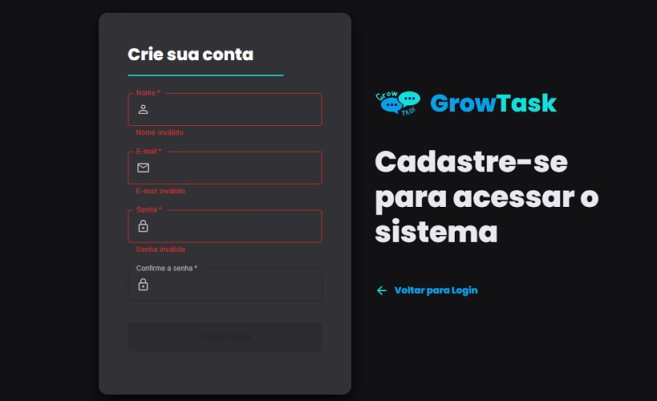
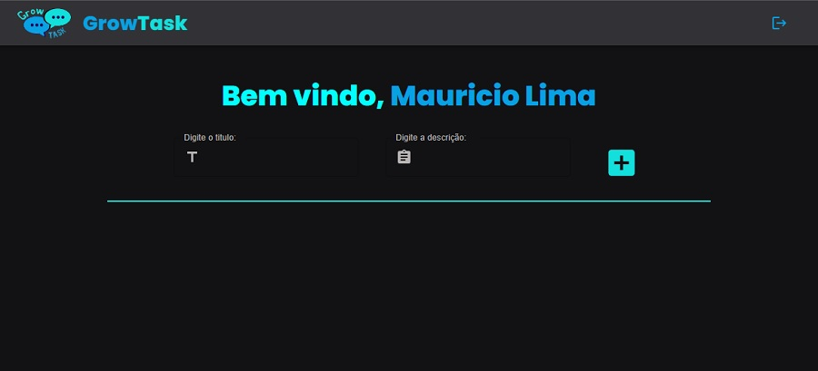
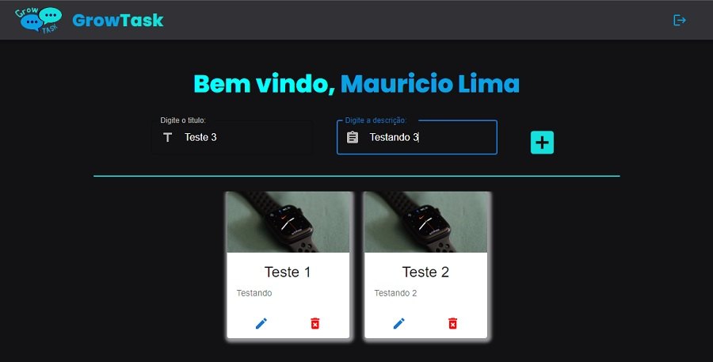
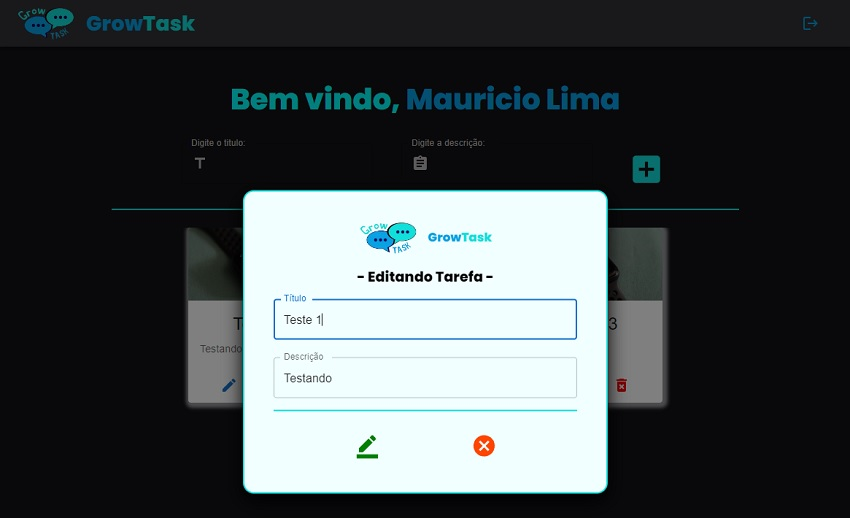
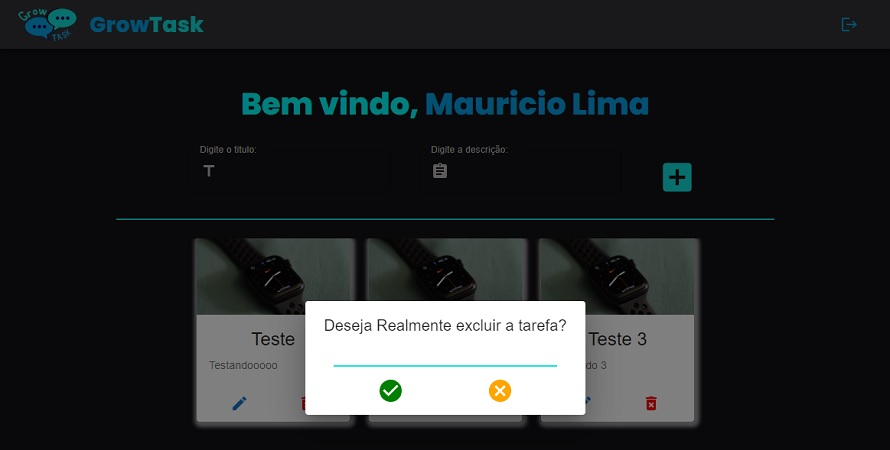

<h1 align="center">- GrowTask - </h1>
<h1  align="center"> Sistema de tarefas/recados </h1>

 
Atividade realizada para o final do módulo <strong>Front-end III</strong> do programa Starter da  <a href="https://www.growdev.com.br/">Growdev</a>.

&nbsp;&nbsp;&nbsp;|&nbsp;&nbsp;&nbsp;
  <a href="#-tecnologias">Tecnologias</a>&nbsp;&nbsp;&nbsp;|&nbsp;&nbsp;&nbsp;
  <a href="#-projeto">Projeto</a>&nbsp;&nbsp;&nbsp;|&nbsp;&nbsp;&nbsp;

 
 
  <h2 align="center"> Deploy: <a href="https://growtask.vercel.app/"> GrowTask</a> </h2>
 
 

  

  

  

  

  

  

 

## 🚀 Tecnologias

Esse projeto foi desenvolvido com as seguintes tecnologias:

- [ReactJS](https://create-react-app.dev/docs/getting-started/)
- [Typescript](https://www.typescriptlang.org/)
- [Redux](https://redux-toolkit.js.org/introduction/getting-started)
- [React Router Dom](https://reactrouter.com/en/v6.3.0/getting-started/installation)
- [Styled Components](https://styled-components.com/)
- [Material UI](https://mui.com/pt/material-ui/getting-started/overview/)
- [Node e NPM](https://nodejs.org/)
- [Redux Persist e createEntityAdapter](https://redux-toolkit.js.org/usage/usage-guide)

 

## 💻 Projeto

O Growtask é um sistema que foi desenvolvido para a atividade final do módulo "Front-end III" do programa Starter da Growdev.  Versão atualizada do projeto <a href="https://github.com/mauriciolima2701/loginRecados_growTask"> LoginRecados. </a>
